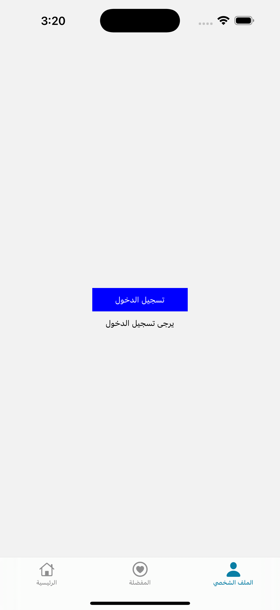

# Welcome to City Pulse 👋

This is an [Expo](https://expo.dev) project created with [`create-expo-app`](https://www.npmjs.com/package/create-expo-app). to demonstrate an artificial app that helps users. to discover events.

## Steps to run the app

1. Install dependencies

   ```bash
   npm install
   ```

2. Start the app

   ```bash
   npx expo start
   ```

### NOTE:
   ```
if you see error regarding describe function doesn't exist, just dismiss it.
   ```


In the output, you'll find options to open the app in a

- [development build](https://docs.expo.dev/develop/development-builds/introduction/)
- [Android emulator](https://docs.expo.dev/workflow/android-studio-emulator/)
- [iOS simulator](https://docs.expo.dev/workflow/ios-simulator/)
- [Expo Go](https://expo.dev/go), a limited sandbox for trying out app development with Expo

You can start developing by editing the files inside the **app** directory. This project uses [file-based routing](https://docs.expo.dev/router/introduction).

## Assumptions
### 1-Expo not CLI:
Expo has been used for the project to accelerate the development.

### 2-Default location:
The default location is all cities provided by the API.

### 3-Target user geographic are:
The user can be living or interested in Local events that are provided by the api, hence the user is only allowed to pick from the available cities/all of the USA.

### 4-Handling state management:
Redux has been used to be the state management solution, not because it's the perfect choice for the project, rather to show that we can scale in future and still cope with the ever changing requirements and enhancements without messing with thd global state.

### 4-TS instate of js:
To make development less error prone TS has been used.


### 4-Optimization:
to touch on this topic of optimization, the Home screen is designed to call the api on demand as the user scrolls and get 10 Events each time, append it to the previous ones.

## Screenshots (Samples)
### 1-File structure


### 2-Home Screen


### 3-Event Details Screen


### 4-Profile Screen


### 4-Favorites Screen


### 4-Closing comments:
-interceptors, and other features has been added to the project to demonstrate advanced topics. though there're many aspects that needs enhancements (e.g: handling RTL automatically, adding biometric login, Error with jest describe function etc.)